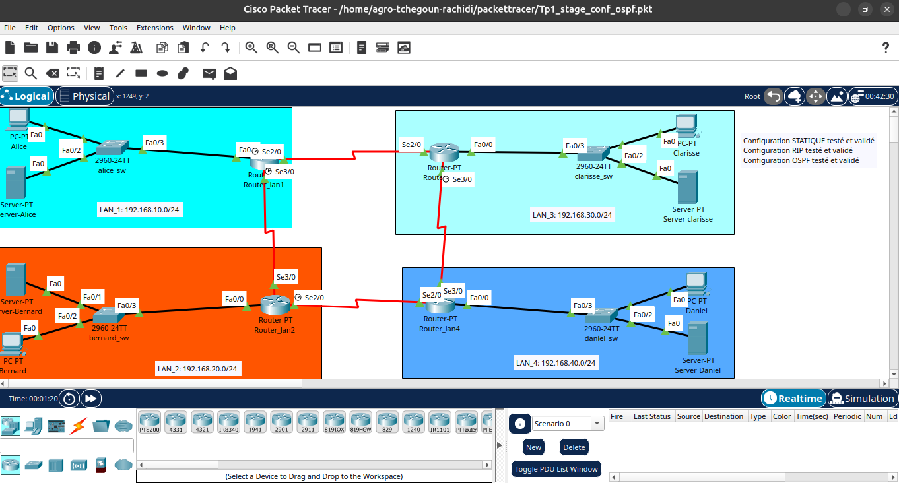
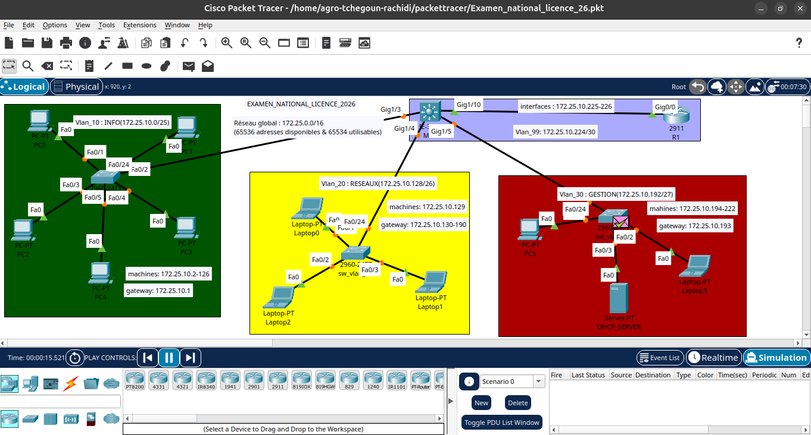
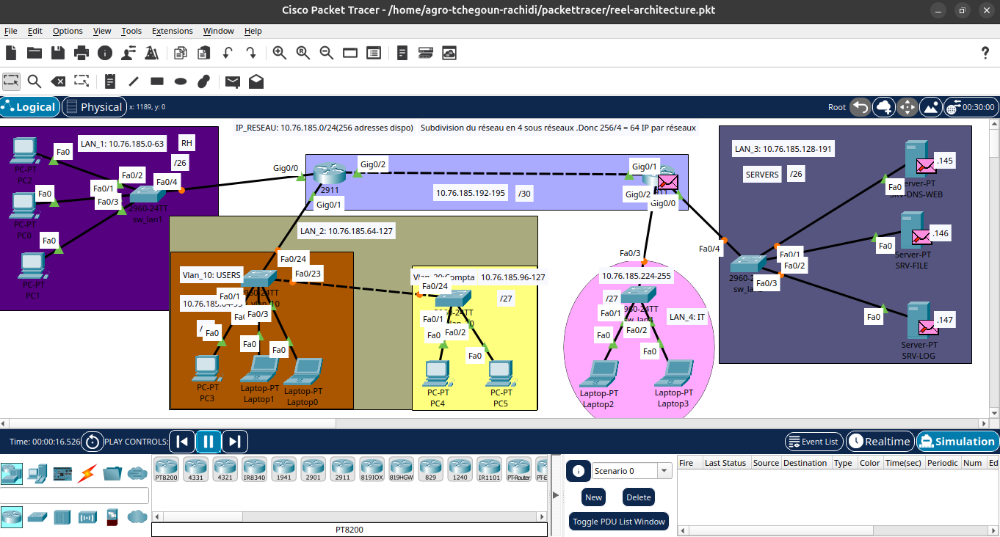

# Labos réseau Cisco, de la théorie VLSM à l'architecture multi-sites

Transparence: 
> Les configurations présentées ci-dessous sont les configurations réelles
> utilisées dans ces six labos, telles qu'exportées depuis Packet Tracer.
> Les résultats indiqués proviennent soit d'annotations laissées
> directement dans les fichiers de projet au moment des tests, soit de ce
> qui est visible sur les captures des topologies actives (indicateurs de
> statut, distribution DHCP effective). Les sorties brutes des commandes de
> vérification n'ont pas été conservées à l'époque et ne sont donc pas
> reproduites ici. Toutes les adresses IP sont des plages privées de
> simulation (RFC 1918), sans lien avec une infrastructure réelle.

## En bref
Six exercices progressifs sur Cisco Packet Tracer, menés entre juillet et
septembre 2026, pour apprendre à concevoir et sécuriser un réseau
d'entreprise, du simple VLAN jusqu'à une architecture multi-sites complète.

## Labo 1, VLAN et routage inter-VLAN (Router-on-a-Stick)

Cinq VLAN créés (RH, Comptabilité, Informatique, Direction, Management),
chacun avec sa propre plage d'adresses. Un routeur unique gère le trafic
entre eux via des sous-interfaces, une technique appelée Router-on-a-Stick.

Voir la configuration complète

! --- Switch ---
vlan 10
name RH
vlan 20
name Comptabilite
vlan 30
name Informatique
vlan 40
name Direction
vlan 99
name Management

interface range FastEthernet0/1 - 6
switchport mode access
switchport access vlan 10

interface range FastEthernet0/7 - 12
switchport mode access
switchport access vlan 20

interface range FastEthernet0/13 - 18
switchport mode access
switchport access vlan 30

interface range FastEthernet0/19 - 23
switchport mode access
switchport access vlan 40

interface FastEthernet0/24
switchport mode trunk
switchport trunk encapsulation dot1q

interface vlan 99
ip address 192.168.99.10 255.255.255.0
no shutdown

! --- Routeur ---
interface GigabitEthernet0/0
no shutdown

interface GigabitEthernet0/0.10
encapsulation dot1Q 10
ip address 192.168.10.1 255.255.255.0

interface GigabitEthernet0/0.20
encapsulation dot1Q 20
ip address 192.168.20.1 255.255.255.0

interface GigabitEthernet0/0.30
encapsulation dot1Q 30
ip address 192.168.30.1 255.255.255.0

interface GigabitEthernet0/0.40
encapsulation dot1Q 40
ip address 192.168.40.1 255.255.255.0

ip dhcp pool VLAN10_RH
network 192.168.10.0 255.255.255.0
default-router 192.168.10.1
dns-server 8.8.8.8

**Résultat** : toutes les interfaces sont montées correctement, le mode
simulation de Packet Tracer confirme le passage du trafic entre VLAN via
les sous-interfaces, et chaque appareil reçoit bien une adresse DHCP
correspondant à son VLAN.

## Labo 2, ACL étendue et sécurité des ports

Objectif : le service Commercial ne doit jamais pouvoir joindre le service
Admin, tandis que le service IT garde un accès complet à tout. Chaque port
d'accès est aussi limité à une seule adresse MAC, pour empêcher qu'un
appareil non autorisé soit simplement branché sur le réseau.

Voir la configuration complète

ip access-list extended BLOCK_COMMERCIAL_TO_ADMIN
deny ip 192.168.30.0 0.0.0.255 192.168.10.0 0.0.0.255
permit ip any any

interface GigabitEthernet0/0.30
encapsulation dot1Q 30
ip address 192.168.30.1 255.255.255.0
ip access-group BLOCK_COMMERCIAL_TO_ADMIN in

interface range FastEthernet0/1 - 6
switchport mode access
switchport access vlan 10
switchport port-security
switchport port-security maximum 1
switchport port-security violation shutdown
switchport port-security mac-address sticky

**Résultat**, annotation laissée directement dans le fichier de projet :
*"Tout est OK ! Commercial ne peut pas communiquer avec admin (ACL
étendue), la sécurisation des ports activée. Un Mac par port."* Testé
concrètement : le ping de Commercial vers Admin échoue (bloqué), le ping
d'IT vers Admin réussit, et brancher un second appareil sur un port
protégé coupe automatiquement ce port.

## Labo 3, routage multi-sites : statique, puis RIP, puis OSPF

Quatre sites reliés en anneau par des liaisons WAN, avec la même
interconnexion testée successivement avec trois méthodes de routage
différentes, pour comparer leurs avantages et limites.

Voir la configuration complète

! --- Phase 1 : routage statique ---
ip route 192.168.20.0 255.255.255.0 10.0.12.2
ip route 192.168.30.0 255.255.255.0 10.0.13.2
ip route 192.168.40.0 255.255.255.0 10.0.12.2
! (répété sur chacun des 4 routeurs pour ses réseaux distants)

! --- Phase 2 : RIP version 2 ---
router rip
version 2
no auto-summary
network 192.168.10.0
network 10.0.12.0
network 10.0.13.0

! --- Phase 3 : OSPF, aire unique ---
router ospf 1
router-id 1.1.1.1
network 192.168.10.0 0.0.0.255 area 0
network 10.0.12.0 0.0.0.3 area 0
network 10.0.13.0 0.0.0.3 area 0

**Résultat**, annotation directe : *"Configuration STATIQUE testée et
validée. Configuration RIP testée et validée. Configuration OSPF testée et
validée."* Ce qui ressort de cette comparaison : le routage statique
demande 12 lignes de configuration manuelle, source d'erreurs à mesure que
le réseau grandit ; RIP propage les routes automatiquement mais reste
limité à 15 sauts et converge lentement ; OSPF converge le plus vite et
passe le mieux à l'échelle, le plus proche de ce qu'on utiliserait en
production.

## Labo 4, VLSM et routage inter-VLAN sur commutateur multicouche

Exercice dans les conditions d'un examen national : à partir d'un seul
bloc d'adresses, découper des sous-réseaux de tailles différentes selon
les besoins réels de chaque VLAN (VLSM), sans gaspiller d'adresses.

Voir la configuration complète

ip routing

interface vlan 10
ip address 172.25.10.1 255.255.255.128
no shutdown

interface vlan 20
ip address 172.25.10.130 255.255.255.192
no shutdown

interface vlan 30
ip address 172.25.10.193 255.255.255.224
no shutdown

interface vlan 99
ip address 172.25.10.225 255.255.255.252
no shutdown

ip route 0.0.0.0 0.0.0.0 172.25.10.226

**Résultat** : le routage entre VLAN est géré entièrement par le
commutateur multicouche, sans passer par le routeur (réservé au trafic
sortant), et chaque VLAN reçoit ses adresses via un relais DHCP pointant
vers un serveur central.

## Labo 5, architecture VLSM avec politique de sécurité complète

Un plan d'adressage pensé pour évoluer : le découpage initial en 4 blocs
égaux a dû être ajusté en cours de projet pour intégrer deux nouveaux
services (IT et Comptabilité), sans repartir de zéro.

Voir la configuration complète

! Politique d'acces par service (extrait)
ip access-list extended USER_POLICY
permit tcp 10.76.185.64 0.0.0.31 host 10.76.185.145 eq 80
permit tcp 10.76.185.64 0.0.0.31 host 10.76.185.145 eq 443
permit udp 10.76.185.64 0.0.0.31 host 10.76.185.145 eq 53

! Securite de niveau 2
ip dhcp snooping
ip dhcp snooping vlan 10,20,30,40

ip arp inspection vlan 10,20,30,40

interface range FastEthernet0/1 - 20
switchport port-security maximum 1
switchport port-security violation shutdown
switchport port-security mac-address sticky

**Ce que ce labo ajoute par rapport aux précédents** : chaque service
n'accède qu'aux ressources qui lui sont utiles (règle du moindre
privilège), une protection contre les faux serveurs DHCP
(DHCP Snooping), et une protection contre l'usurpation d'adresse
(Dynamic ARP Inspection).

## Labo 6, projet de synthèse : réseau d'entreprise multi-sites

*Note : "AFRISEC" est le nom donné à cet exercice de synthèse pendant la
formation, sans lien avec une organisation réelle.*

Le plus complet des six : un siège avec 8 segments différents (téléphonie
IP, invités, IT/SOC, comptabilité, caméras, serveurs, RH, direction) relié
à deux agences (Bohicon et Parakou) par des liaisons WAN.

Voir la configuration complète

! Commutateur coeur, routage inter-VLAN
ip routing

interface vlan 10
description Voice
ip address 172.16.0.1 255.255.255.128
no shutdown

interface vlan 70
description RH
ip address 172.16.1.81 255.255.255.240
no shutdown

! Trunk limite aux VLAN necessaires (pas "all")
interface GigabitEthernet1/1
switchport mode trunk
switchport trunk allowed vlan 10,70

! VLAN voix sur un port partage avec un PC
interface range FastEthernet0/1 - 10
switchport mode access
switchport access vlan 70
switchport voice vlan 10
spanning-tree portfast

! Routeur WAN, liaisons vers les agences
interface Serial0/0/0
description WAN to Bohicon
ip address 10.10.10.1 255.255.255.252
clock rate 64000
no shutdown

router ospf 1
router-id 10.10.10.1
network 10.10.10.0 0.0.0.3 area 0
network 172.16.0.0 0.0.3.255 area 0

**Justification du plan d'adressage** : avec 196 appareils attendus et une
marge de croissance de 50%, un bloc /24 (254 adresses) était trop juste et
un /23 ne laissait aucune marge réelle. Le choix d'un /22 (1022 adresses)
donne de la place pour grandir sans tout redécouper plus tard.

**Résultat** : les 8 segments du siège communiquent entre eux via le
commutateur coeur, les deux agences sont joignables depuis le siège via
les liaisons WAN, et le VLAN voix fonctionne correctement sur un port
partagé avec un poste de travail.

## Ce que ces six labos démontrent
- Conception et segmentation VLAN, trunking 802.1Q
- Routage inter-VLAN (Router-on-a-Stick et commutateur multicouche)
- Politiques de sécurité par ACL étendue
- Sécurité de niveau 2 (port security, DHCP snooping, inspection ARP)
- Adressage VLSM raisonné, avec justification de chaque taille de sous-réseau
- Architecture WAN multi-sites avec OSPF
- Capacité à faire évoluer un plan existant sans tout reconstruire

## Outils utilisés
Cisco Packet Tracer 8.x, syntaxe Cisco IOS 15.x. Tous les environnements
sont des exercices pédagogiques simulés, sans donnée de production.

